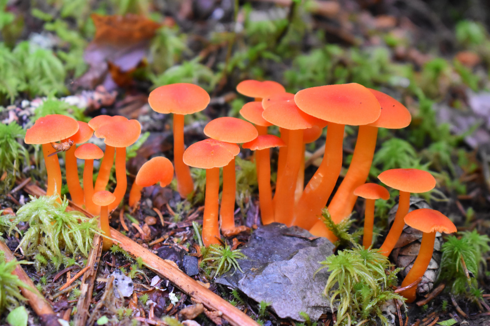
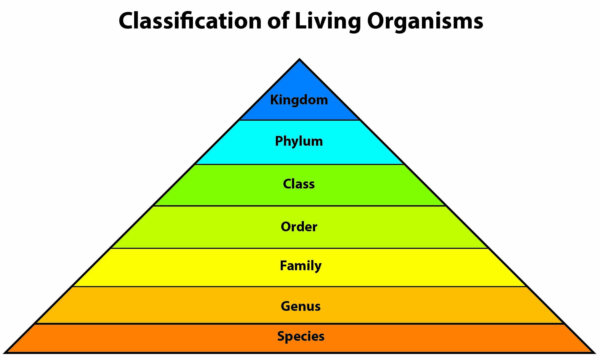
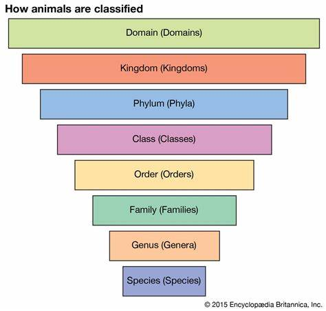

	Classifying Fungi Using Convolutional Neural Network

  

Classifying images of different fungi specifically from the Ascomycota, and Basidiomycota Phylum under the Kingdom of Fungi, to test whether or not they are edible or poisonous.
 
 
The images are derived from kaggle, they are taken by a private photographer.
 
 
The data set structure was created by me using the images from kaggle with a function created in my notebook, and the finished data set contains over 7,000 data points.
 
 
Using a Convolutional Neural Network model I created an application that is able to test these species to an accuracy rate of 99%.

 

## Overview and Disclaimer

 

I wanted to test out developing a mobile application or web platform that would enable a user to upload an image of a  mushroom they have found, and identify whether a it os poisonous or safe to consume. 

 

This could be particularly useful for mushroom foragers, hikers, or individuals who are interested in wild mushroom hunting. 
Although to create an application accurate enough to dance with life or death is somehting that would take more than a mere few months and one persons work, no matter how much work was put in. 

 

So for future note this application is to soley be used as an educational tool for guidance on ones journey through the woods.

 

This type of application would also provide valuable assistance to individuals who are not expert mycologists but still wish to engage in mushroom foraging or learn more about the mushrooms they encounter in the wild. It could help prevent accidental ingestion of toxic mushrooms, reducing the risk of poisoning and potentially saving lives.

 

## Main Goals in Project

 

Our goal is to be able to build an interactive app for National Geographic that can classify an image of a mushroom that is commonly found on the west coast,  as either poisonous or edible for individuals who are not expert mycologists for educational purposes.

With the research that has been done I was able to identify:
	- which features of a mushroom will be most important 
	- how I should group mushrooms together when classifying them
 

**For this presentation the mushrooms were grouped by Genus:**

Preface: 
A Genus is a category that contains groups of similar species and is the rank above the category species, which is just an individual mushroom, in the classification ranking system for living organisms, which is shown in the diagram here. 

 

  

 

They were grouped this way because the images used were only sufficient enough to be able to classify a Genus of mushroom not all of the individual Species within the Genus rank, if a genus contains a toxic species it is classified as ‘containing poisonous species’. Only the Genus with no poisonous species are classified as ‘edible’.

 

## Mandatory Preliminary Research on Subject

  Classification System for Living Organisms

  

There are three Domains, Archaea, Bacteria, and Eukarya.

 

The domain Eukarya is the only domain that represents multicellular, nucleated, and visible organisms. 
Eukarya consists of organisms that have a true nucleus and structures called organelles that are surrounded by membranes.
I.e - visible living organisms 

 
 

**Within the domain Eukarya there are four kingdoms:**

**Kingdom Protista:** which consists of single-celled organisms, algae being an example.

 

**Kingdom Fungi:** consisting of mildew, molds, yeasts, and mushrooms, being organisms that absorb nutrients from other organisms.

 

**Kingdom Plantae:** that contains all species of plants that are organisms that make their own food through the process of photosynthesis

 

**Kingdom Animalia:** containing over 1 million species, that consists of multicellular organisms that must consume other organisms for energy.

 
 

Because this is a mushroom classification set we will be focusing on the Fungi Kingdom.

That being said, the Fungi Kingdom, consists of 7 Phyla those being;

Chytridiomycota, 
Blastocladiomycota, 
Neocallimastigomycota, 
Microsporidia, 
Glomeromycota, 
Ascomycota, and 
Basidiomycota 

 
 

The 2 Phyla we will be focusing our research further on are the Ascomycota, and Basidiomycota Phylum (plural for Phyla) 

Ascomycota, and Basidiomycota actually compose the only two Phyla in Dikarya the Sub-Kingdom of Fungi Kingdom, which is a Sub-Kingdom for mushroom-like species.
Ascomycota includes a diverse range of species, such as yeasts, molds, truffles, and morels. 
Basidiomycota includes mushrooms, toadstools, puffballs, and bracket fungi. 

 
 

	What is the difference between these Phyla?
The basic answer is Ascomycetes and Basidiomycota use different methods of spore production and dispersal.

 

The Basidiomycetes Pyhla produce sexual spores called basidiospores. They play significant roles as decomposers, mycorrhizal symbionts, and plant pathogens. 

 

While the Ascomycetes Phyla  produce spores within specialized structures called asci. 
They have a wide array of ecological roles, including decomposition, plant symbiosis, and pathogens of plants and animals. 
Some well-known examples include Penicillium, Saccharomyces (brewer's yeast), and morel mushrooms.

 
 

#### Phylum Ascomycota
The Phylum Ascomycota contains three Subdivisions:

	Taphrinomycotina
	Saccharomycotina
	Pezizomycotina

 

#### Phylum Basidiomycota
The Phylum Basidiomycota contains three Subdivisions:

	Agaricomycotina
	Pucciniomycotina
	Ustilaginomycotina
 
 

Things will start to get quite complex if we continue going down the Living Organisms Classification System latter, an example being, The Sub-Division Agaricomycotina 

Agaricomycotina contains three Classes:

Tremellomycetes,
Dacrymycetes,  
Agaricomycetes.

 

Furthermore, the Class Agaricomycetes under the Sub-Division Agaricomycotina:

	Includes 17 Orders, 100 Families, 1147 Genera, and 20951 Species.

 
 

On another note, we have finally reached a point on the Living Organisms Classification System where we will only be including mushrooms, and have excluded any fungi that is not a typical mushroom.

 

An extensive amount of research has been conducted to determine who general we can be when classifying our mushroom image. 
	I.e – Can we label mushrooms being poisonous or edible just based on their Family?
The answer to that is NO. 	

 
 

We are still in too broad of a category to be able to classify that category as edible or poisonous.
Therefore, we are going to travel down the Living Organisms Classification System latter to the Genus rank.

 
 

The Genus rank is in between the Family and Species ranks.

An example to make sure you are following; Among animals, for example, the species of horses and zebras both from the Genus Equus.
This is how we are going to classify our mushrooms as either edible or poisonous.

 
 

The 11 mushroom Genus we are going to be focusing on for this mushroom image classification model are:

 
	Exidia
  
	Inocybe
  
	Agaricus
  
	Amanita
  
	Boletus
  
	Cortinarius
  
	Entoloma
  
	Hygrocybe
  
	Lactarius
  
	Russula
  
	Suillus

 
 
 

#### Exidia - EDIBLE
The Exidia Genus of mushrooms do not have any toxic or poisonous species, we will be classifying them as edible, 
although it is duly noted that they do not have any culinary value, as they are not tasty due to their spongey gelatine structure.

 
 

#### Inocybe - CONTAINS POISONOUS SPECIES
The Inocybe Genus of mushrooms have multiple toxic species that cause a wide range of nasty side effects including gastrointestinal distress, hallucinations, muscle weakness, and in severe cases, organ failure, none will cause instant death but ingestion will still cause harm. 
Therefore we will be classifying these as poisonous.

 
 

#### Agaricus - CONTAINS POISONOUS SPECIES
There are many very common Agaricus species that are edible such as the portobello mushroom, but there are also species of the Agaricus that are highly poisonous, 
that being the Agaricus Xanthodermus, which is most commonly found outside, because this app is mainly going to be sued for people hiking outdoors, 
we are going to classify the Agaricus Genus as poisonous considering the Agaricus Xanthodermus is more commonly found than the edible species outside.

 
 

#### Amanita - CONTAINS POISONOUS SPECIES
Most of the Amanita species are highly, highly toxic, an infamous mushroom found under the Amanita Genus, is the Amanita Phalloides or commonly called Death Cap, is quite literally the most poisonous mushroom in the world. 
We will definitely be classifying the Amanita Genus as poisonous.

 
 

#### Boletus - CONTAINS POISONOUS SPECIES
Many edible species but does contain toxic and inedible species, contains the Devil's Bolete, a highly highly toxic mushroom. 
While the Boletus Erythropus is extremely bitter and has no culinary value. 
So Boletus is classified as poisonous.

 
 

#### Cortinarius - CONTAINS POISONOUS SPECIES
Several of the Cortinarius Genus species are known to be poisonous, while many of the species are harmless, some are extremely toxic, and cause nast side effects. 
Therefore, Cortinarius is classified as poisonous. 

 
 

#### Entoloma - CONTAINS POISONOUS SPECIES
There are indeed some species within the Entoloma Genus that are known to be extremely poisonous, severe side effects included with the toxins when ingesting. 
Only a few non toxic species. Will be classifying Entoloma as poisonous.

 
 

#### Hygrocybe - EDIBLE
There are no known species within the Hygrocybe Genus to be poisonous, they are also known as waxcaps. There are no significant toxins if you were to consume. Hygrocybe will be classified as edible.

 
 

#### Lactarius - CONTAINS POISONOUS SPECIES
Some species within the Lactarius Genus that are known to be extremely poisonous, severe side effects included with the toxins when ingesting. 
Only a few non toxic species. Will be classifying Lactarius as poisonous.

 
 

#### Russula - CONTAINS POISONOUS SPECIES
The Russula Genus contains some poisonous species that cause severe side effects and problems. 
Therefore, I will be classifying the Russula Genus as poisonous.

 
 

#### Suillus - CONTAINS POISONOUS SPECIES
No species within the Suillus Genus contains any toxins or is poisonous, not all of the species have culinary value but are considered edible. 
Will be classifying the Suillus Genus as edible.

 
 
 

## Building The CNN Model

 

**First** step was to prepare the data set which was done by feature engineering with a for loop function, to label all the mushroom Genus. We started off by understanding the data which our research presented above.

 

I was able to notice that the images were only sufficient enough to classify per Genus not per species, and would have needed a lot more images. The data set was created with a loading image function, and my preprocess function, so that all images were the same shape, and size.

 
 

**Second** step was modelling. Because we are trying to come up with the most accurate prediction possible of whether a mushroom is poisonous or edible, and the correct genus of mushroom, I decided to focus on the accuracy metric. 

 

After working with multiple models I was able to come down to a final model with a 99.86% final accuracy score. The accuracy score represents what percentage of our models predictions were actually correct, that being both true positives and true negatives.

 
 

### Baseline Model

  

 
 

### Final Model Training Data

  

 
 

### Final Model Testing Data

  

 
 

**Third** step was creating visuals that can provide us insight on how we should be moving forward. 
 
I thought that visualizing the different image activations of the model would provide valuable insight on which features of the mushroom were vauluable when the model was going through its classification process.

 
 
 

## Feedback From Working Model

 

To better understand how we can build a model that will be able to correctly classify a mushroom, I created visuals for the different activations of a model to determine its class.

 

The purpose of visualizing activation maps is to identify regions of the image that contribute significantly to the model's decision-making process.

 

The intensity of color represents the level of activation. The regions with higher activation values are brighter and warmer colors, while regions with lower activation values appear darker or cooler.

 
 

These images show three different kinds of mushroom Genus that I classified, showing their top activation points. 
	I have also included a reference to the mushroom's original image to better visualize what's going on.

 

  

After analyzing many different activations I found that one of the most common activations for the model was the cap of the mushroom,- for example the texture of or form of the cap, and how it curves or ripples.

 

  

The second most common activation or region that significantly contributed to my models decision making process, was the very top of a mushroom's cap, almost like the model is trying to determine what the mushroom may look like from a bird's eye perspective. Here we can see the brighter parts focus on the top of the cap.

 

  

And the third most significant region of a mushroom, at least with my model, was the outline of the mushroom's shape; here we can see the same mushrooms but only their outlines are significant to the decision, as they are the brightest.

 
 
 

## Future Reccomendations

 

Inorder for National Geographic to create a safe and trustworthy interactive app for individuals who are not expert mycologists. I would like to recommend...

 

**One:** Having an extremely large and diverse set of  images containing the mushroom shape, the top of the mushroom from a bird's eye view, and all angles of the mushroom cap.

 

**Two:** if the data team aren't experts I want to recommend predicting edibility based on the mushroom's genus, as mushrooms can look extremely alike, so classifying by genus ensures safety. Especially when working with a smaller amount of images. 
So depending on how serious the team is when collecting images this is an important thing to consider.

 

**Three:** Do not recommend consuming any mushrooms in the wild as they are extremely hard to classify and people should only get information from experts. 
This disclaimer can potentially save lives as nothing is ever 100% accurate.

 
 
 

## Next Steps Moving Forward With the Project

 

The next steps that should be taken with this project is to collect more images based on the new recommendations, to also consider working with an expert to be able to classify the mushroom's edibility by species, and to conduct much deeper research on how species differ, and if edibility could even affect appearance.

 

